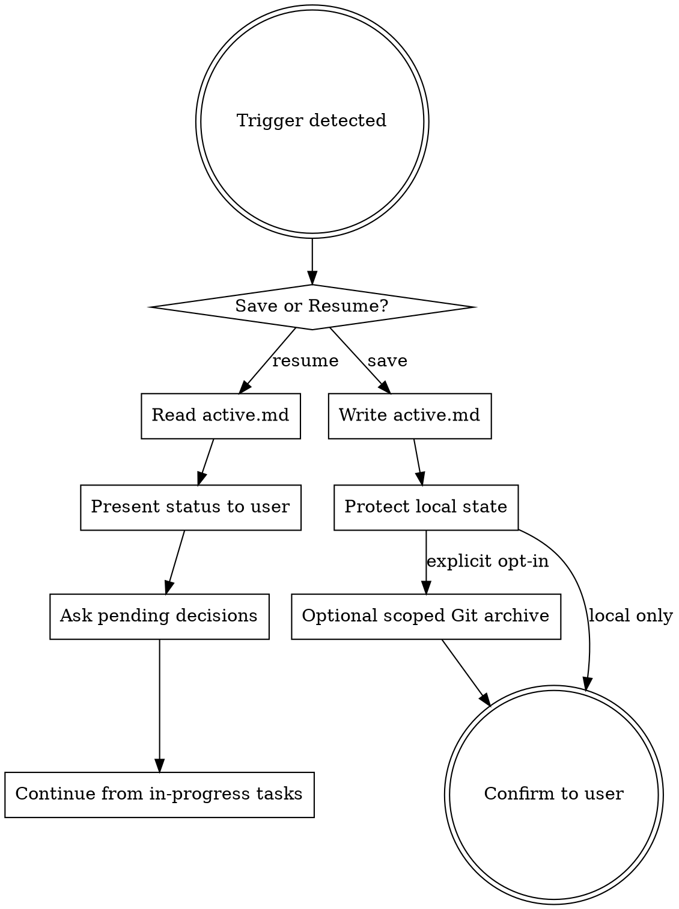

# Session Persistence

Save and resume long-running multi-session work without losing computed state, decisions, or context.

## When to Use

- User says "quit", "pause", "save progress", "pick up later"
- You complete a major milestone (audit done, phase complete, decision made)
- Starting a session and `.opencode/sessions/active.md` exists
- Session has >5 tool calls and accumulated non-trivial state

## When NOT to Use

- Single-shot tasks that complete in one session
- Pure Q&A / informational conversations
- Task has no computed state worth preserving

## Core Protocol



## File Location

```
<project-root>/.opencode/sessions/
└── active.md    # Current session (always this name)
```

**Always `active.md`** — no ambiguity about which file to read on resume. The local file is the current state; optional Git archival is governed by the safety rules below.

## Storage and Data Safety

`active.md` is local working state by default. Persistence must not create a data leak or modify the project's public history without explicit consent.

- **Never store secrets** — omit tokens, passwords, cookies, private keys, credentials, secret environment values, and sensitive personal data. Record a safe retrieval instruction instead.
- Save non-secret identifiers only when they are required to resume. Treat internal URLs, customer data, and access-controlled resource IDs as sensitive unless the user says otherwise.
- In a Git worktree, keep `.opencode/sessions/active.md` untracked. Add it to `.git/info/exclude` when practical; do not modify the shared `.gitignore` unless the user asks.
- Never stage, commit, or push session state unless the user explicitly opts into Git archival and confirms the repository and remote have suitable access controls.
- With explicit opt-in, stage and commit **only** `.opencode/sessions/active.md`. Never use a broad `git add` for session archival and never include unrelated staged changes.

## Save Protocol

### Auto-Save Triggers

Auto-save the local `active.md` file (without committing it) after:
- Any completed phase/milestone
- User answers a blocking decision
- Expensive audit/search completes (>5 API calls of results)
- Before executing destructive operations

### What to Capture

**MANDATORY — capture resumable state without recording secrets or sensitive data:**

1. **Safe computed keys/IDs** — preserve every non-secret API-derived identifier, variable key, component key, and library key required to resume. For sensitive values, store a safe retrieval instruction instead of the value.

2. **Full mapping tables** — if you built a non-sensitive mapping (A→B), save the COMPLETE table. Partial tables are useless. If the full table exists in an external file, reference that file in Relevant Files AND verify it's up-to-date. If it only exists in conversation context, inline it entirely in Key Data — even if it's 200+ rows. Redact or omit sensitive columns.

3. **Page/scope breakdown** — which pages/files to process, which to skip, current progress per-page.

4. **Decisions with FULL context** — not just "Approach A or B?" but the complete explanation of what A and B mean, their tradeoffs, and what information the user needs to decide.

5. **Resume instructions** — specific, actionable first steps. Not "continue migration" but "Run script X on pages Y-Z using keys from the Key Data section."

6. **Relevant file paths** — every file that contains important context for this work. This means OTHER files (plans, specs, mapping tables, configs), not just self-referencing `active.md`. Prefer project-relative paths and avoid exposing private home-directory structure.

### File Format

```markdown
---
goal: <one-line objective>
started: 2026-05-19
last-saved: 2026-05-19T14:30:00
status: paused | blocked | completed
blocked-by: <what's needed before resuming — omit if not blocked>
---

# Session: <Descriptive Name>

## Goal
<2-3 sentences describing the overall objective>

## Constraints
<Bullet list of rules/preferences governing the work>

## Decisions Made
| # | Decision | Choice | Rationale |
|---|----------|--------|-----------|
| 1 | ... | ... | ... |

## Decisions Pending
<!-- FULL context for each — a fresh session must be able to present these
     to the user without re-deriving anything -->
### Decision N: <Title>
**Question:** ...
**Options:**
- A: <full explanation>
- B: <full explanation>
**Context:** <why this matters, what depends on it>
**Relevant data:** <any keys/values needed to understand the options>

## Progress
### Completed
- [x] Task (outcome, artifact location if any)

### In Progress
- [ ] Task (current state, what remains)

### Not Started
- [ ] Task

## Key Data
<!-- Every safe, expensive-to-derive value required to resume goes here -->
<!-- Use YAML code blocks for structured data -->
```yaml
file_key: "re4FnhqStNUMwogNpySy3h"
library_keys:
  ds25_foundations: "lk-ef923..."
  ds25_core: "lk-2818..."
variable_keys:
  foreground/ghost/hover: "ed13a66e..."
  foreground/ghost/active: "1a2e4f5c..."
  # ... include every safe value required to resume
component_keys:
  ds25_button: "key..."
  ds25_badge: "key..."
audit_totals:
  variables: 209
  bindings: 52718
  pages_to_process: 34
```

## Relevant Files
- `path/to/file` — what it contains, why it matters for resuming

## Resume Instructions
<!-- Specific, actionable steps — not vague descriptions -->
1. Read this file
2. Read `<specific file>` for the full mapping table
3. Present Decisions Pending to user
4. After decisions: execute <specific action> using keys from Key Data
5. ...
```

## Resume Protocol

When starting a session and `.opencode/sessions/active.md` exists:

1. **Read it fully** — do not skim
2. **Read referenced files** from the Relevant Files section
3. **Present status** — tell user: "Resuming session: <name>. Status: <status>. Last saved: <date>."
4. **If pending decisions exist** — present them immediately with full context (they're already written in the file)
5. **If no decisions pending** — state the next action from Resume Instructions and begin

**Do NOT re-run audits or searches if the data exists in Key Data.** That section exists specifically to avoid redundant API calls.

## Compaction Survival

The optional `session-guard` plugin (installed globally at `~/.config/opencode/plugins/session-guard.ts`)
injects non-empty `active.md` contents into the compaction prompt. It uses OpenCode's experimental compaction hook, verified with OpenCode 1.15.13; future OpenCode releases may require an update.

**Expected post-compaction behavior:**

1. Re-read `.opencode/sessions/active.md` fully
2. Re-read files listed in the "Relevant Files" section
3. Continue from the last in-progress task without announcing compaction to the user
4. Do NOT re-derive state that exists in Key Data — use it directly

## Archiving

When a task completes, delete `active.md`. Local session history is intentionally ephemeral by default.
When starting a NEW task on a project that already has `active.md`, overwrite it only after confirming the prior task is complete or intentionally abandoned.
When RESUMING an existing session, read and continue — do not overwrite.
If the user previously opted into Git archival, stage and commit only the deletion of `.opencode/sessions/active.md` so the branch no longer exposes active state. Earlier versions remain in Git history and must still be treated according to the repository's access controls.

## Red Flags — You're About to Lose State

| Thought | Reality |
|---------|---------|
| "I'll remember this" | You won't. Next session is a blank slate. Save it. |
| "Just the important keys" | Save every safe value needed to resume, but never secrets or sensitive data. |
| "The mapping table is too long" | Length doesn't matter. Completeness and safe handling matter. |
| "I'll re-search if needed" | Re-searching wastes user time and API calls. Save safe results now. |
| "This decision context is obvious" | Obvious to you NOW. Not to a fresh session. Write full context. |
| "Auto-save is overkill here" | If you've done >5 API calls, auto-save locally. No exceptions. |
| "Git makes this safer" | Git preserves deleted content. Archive only with explicit opt-in and appropriate access controls. |
| "I'll save at the end" | Sessions crash. Save after each milestone. |

## Common Mistakes

1. **Saving only a summary** — summaries lose detail. Save the actual safe data (keys, counts, mappings).
2. **Recording secrets** — session state is durable enough to leak. Store retrieval instructions, never credentials.
3. **Omitting decision context** — "A or B?" is useless without explanation. Include full options and tradeoffs.
4. **Vague resume instructions** — "continue the work" helps nobody. Specify exact commands/actions.
5. **Committing by default** — local persistence is the safe default. Git archival requires explicit user opt-in and path-scoped commits.
6. **Waiting for explicit "save"** — auto-save locally on milestones. Don't wait for the user to ask.
